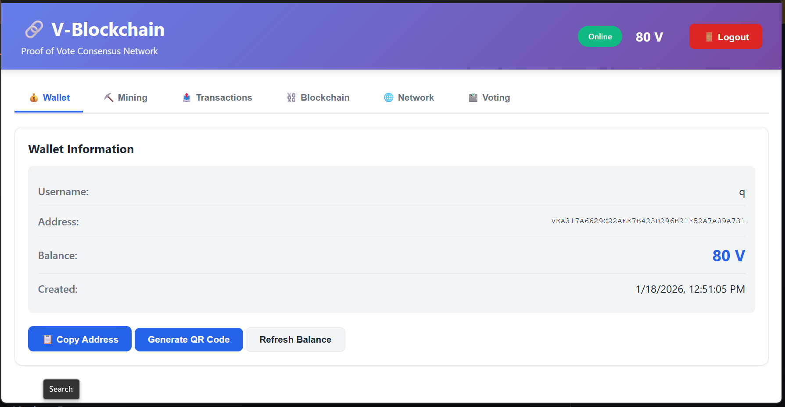
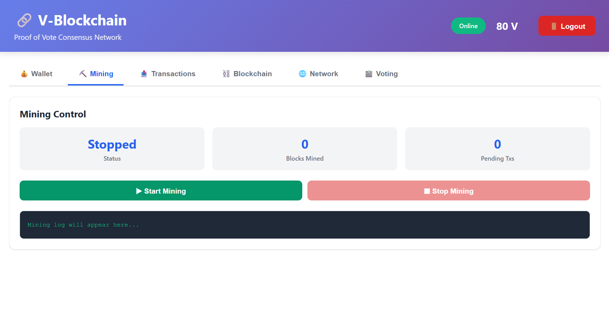
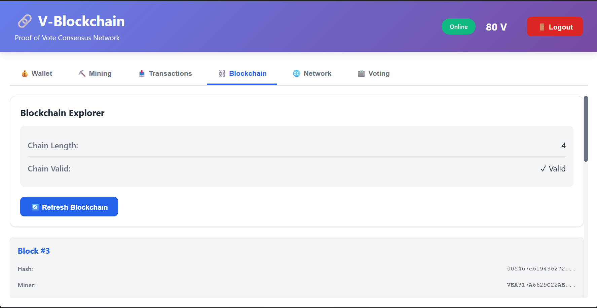
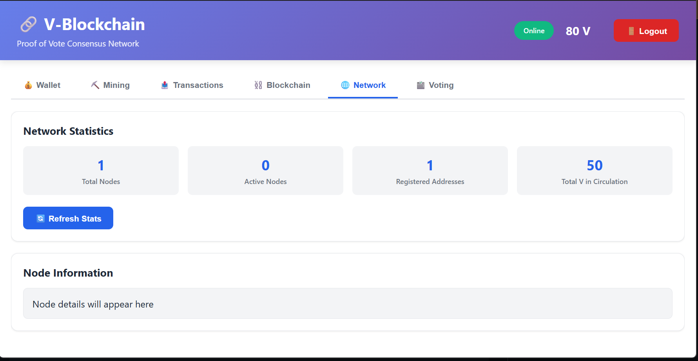
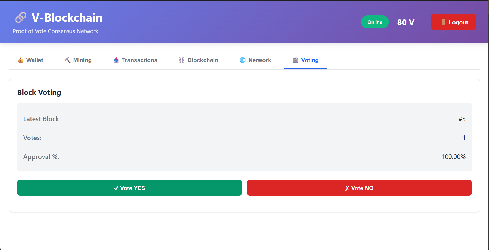

#  V-Blockchain: Decentralized P2P Network

A complete, production-ready peer-to-peer blockchain system with Proof of Vote consensus mechanism, built with Node.js and Electron.

  

---

##  Table of Contents

- [Overview](#overview)
- [Features](#features)
- [Screenshots](#screenshots)
- [Architecture](#architecture)
- [Prerequisites](#prerequisites)
- [Installation](#installation)
- [Usage](#usage)
- [Technical Details](#technical-details)
- [File Structure](#file-structure)
- [Contributing](#contributing)
- [License](#license)

---

##  Overview

**V-Blockchain** is a sophisticated, decentralized cryptocurrency network implementing a novel **Proof of Vote (PoV)** consensus mechanism. Unlike traditional Proof of Work, PoV allows network participants to democratically validate blocks through voting, achieving consensus with a 66.7% approval threshold.

The system features a beautiful dual-interface design:
- **CLI Version**: Command-line interface for advanced users and developers
- **GUI Version**: Professional Electron desktop application for end-users

---

## ✨ Features

###  Security & Cryptography
- **RSA-2048 Encryption** for wallet key generation
- **SHA-256 Hashing** for transaction and block integrity
- **Digital Signatures** for transaction authentication
- **Password-Protected Wallets** with salted hashing

###  Blockchain Technology
- **Immutable Ledger** with blockchain validation
- **Transaction Management** with pending pool and mining
- **Block Mining** with configurable difficulty levels
- **Chain Persistence** with automatic save/load from JSON
- **Balance Tracking** with accurate transaction history

###  Consensus Mechanism
- **Proof of Vote (PoV)** consensus algorithm
- **66.7% Approval Threshold** for block validation
- **Democratic Voting System** where all nodes participate
- **Vote Tracking** with approval percentages

###  P2P Networking
- **TCP Socket Communication** for peer-to-peer connections
- **Automatic Peer Discovery** via bootstrap server
- **Message Broadcasting** for transactions, blocks, and votes
- **Network Synchronization** with real-time updates
- **Boot Node Registration** for decentralized discovery

###  Wallet System
- **Unique V-Addresses** generated from public key hashes
- **50 V Welcome Bonus** for new accounts (one-time only)
- **Transaction History** with sent/received tracking
- **QR Code Generation** for easy address sharing
- **Persistent Storage** with password protection

###  User Interface
- **Professional GUI** built with Electron
- **6-Tab Dashboard**: Wallet, Mining, Transactions, Blockchain, Network, Voting
- **Real-time Updates** with automatic balance refresh
- **Mining Controls** with start/stop functionality
- **Blockchain Explorer** for viewing chain history
- **Network Statistics** showing connected nodes and total circulation

###  Developer Features
- **REST API Server** for network discovery
- **Comprehensive Logging** for debugging
- **Automatic Firewall Configuration** on Windows
- **Clean Architecture** with modular design
- **Jest Test Suite** with 32 comprehensive tests

---

##  Screenshots

### Dashboard & Wallet Management

*Main wallet interface showing balance, address, and quick actions*

### Mining Interface

*Mining control panel with real-time statistics and logs*

### Transaction Management

*Send transactions and view complete transaction history*

### Blockchain Explorer

*View all blocks in the chain with detailed information*

### Network Statistics

*Monitor network nodes, total circulation, and node information*

### Voting System

*Cast votes on pending blocks and view approval percentages*

---

##  Architecture

```
┌─────────────────────────────────────────────────────────────┐
│                    Desktop Application                       │
│  ┌──────────────────────────────────────────────────────┐   │
│  │              Electron Main Process                   │   │
│  │  (IPC Server, Wallet Management, Mining Control)    │   │
│  └──────────────────────────────────────────────────────┘   │
│                           ▼                                  │
│  ┌──────────────────────────────────────────────────────┐   │
│  │              GUI Renderer Process                    │   │
│  │  (6-Tab Dashboard, Real-time Updates, Forms)        │   │
│  └──────────────────────────────────────────────────────┘   │
└──────────────────┬──────────────────────────────────────────┘
                   │
        ┌──────────┴──────────┐
        ▼                     ▼
   ┌─────────────┐      ┌──────────────────┐
   │  Blockchain │      │   P2P Network    │
   │  - Ledger   │      │  - TCP Sockets   │
   │  - Mining   │      │  - Broadcasting  │
   │  - Voting   │      │  - Peer Discovery│
   └─────────────┘      └──────────────────┘
        │                     │
        └─────────────┬───────┘
                      ▼
        ┌──────────────────────────┐
        │  Bootstrap Server        │
        │  - Node Registration     │
        │  - Peer Discovery        │
        │  - Address Registry      │
        │  - Network Statistics    │
        └──────────────────────────┘
```

---

##  Prerequisites

- **Node.js**: v14.0 or higher
- **npm**: v6.0 or higher
- **Windows/Mac/Linux**: Cross-platform compatible
- **RAM**: Minimum 512MB recommended
- **Disk Space**: ~100MB for installation

---

##  Installation

### 1. Clone the Repository
```bash
git clone https://github.com/PointerKnight/v-blockchain.git
cd v-blockchain
```

### 2. Install Dependencies
```bash
npm install
```

### 3. Install Electron (if not included)
```bash
npm install electron@latest --save-dev
```

---

##  Quick Start

### Option 1: Run GUI Application (Recommended)
```bash
npm start
```
Opens the professional Electron desktop application.

### Option 2: Run CLI Version
```bash
node client.js
```
Interactive command-line interface for advanced users.

### Option 3: Run Bootstrap Server
```bash
node server.js
```
Starts the IP registry and boot node on `localhost:3000`.

---

##  Usage

### Creating a New Account
1. Launch the application
2. Enter username and password
3. Click **"Create New Wallet"**
4. Automatically receives 50 V welcome bonus
5. Ready to send/receive transactions

### Sending Transactions
1. Go to **Transactions** tab
2. Enter receiver's address
3. Enter amount to send
4. Click **"Send Transaction"**
5. Transaction goes to pending pool
6. Needs mining to be confirmed

### Mining Blocks
1. Go to **Mining** tab
2. Click **"▶ Start Mining"**
3. Miner automatically mines pending transactions
4. Mining reward: **10 V per block**
5. Block is broadcast to network
6. Receivers automatically sync balances

### Voting on Blocks
1. Go to **Voting** tab
2. View latest block and vote count
3. Click **"✓ Vote YES"** or **"✗ Vote NO"**
4. Block approved when **66.7%+ vote YES**
5. Approval percentage updates in real-time

### Viewing Blockchain
1. Go to **Blockchain** tab
2. View all blocks in descending order
3. Click block to see detailed information
4. Monitor chain validity status

### Network Monitoring
1. Go to **Network** tab
2. View active nodes count
3. See total V in circulation
4. Monitor registered addresses
5. Check your node information

---

##  Technical Details

### Consensus Algorithm: Proof of Vote (PoV)

**How it works:**
1. Miner creates block with pending transactions
2. Block broadcasts to network
3. All nodes validate block structure
4. Nodes vote YES or NO on validity
5. **Approval Threshold**: 66.7% YES votes required
6. Block becomes immutable when approved
7. Next block can be mined

**Advantages over PoW:**
- ✅ Energy efficient (no computational waste)
- ✅ Democratic (all nodes have voting power)
- ✅ Fast finality (instant validation)
- ✅ No mining centralization
- ✅ Scalable (no hashing arms race)

### Transaction Lifecycle

```
User Creates Transaction
        │
        ▼
  Sign with Private Key
        │
        ▼
  Add to Pending Pool
        │
        ▼
  Broadcast to Network (P2P)
        │
        ▼
  Included in Next Block
        │
        ▼
  Block Mined
        │
        ▼
  Votes Collected (66.7% needed)
        │
        ▼
  Block Approved & Finalized
        │
        ▼
  Balance Updated
```

### Cryptographic Details

| Component | Algorithm | Details |
|-----------|-----------|---------|
| Key Pair | RSA-2048 | 2048-bit asymmetric encryption |
| Address | SHA-256 | 40-character V-format address |
| Signature | RSA-SHA256 | Digital transaction signing |
| Hash | SHA-256 | Block and transaction hashing |
| Password | SHA-256 | Salted password hashing |

---

##  File Structure

```
v-blockchain/
├── blockchain.js              # Core blockchain implementation
├── wallet.js                  # Wallet management & key generation
├── p2p.js                     # P2P networking layer
├── miner.js                   # Mining & voting logic
├── server.js                  # Bootstrap server & IP registry
├── client.js                  # CLI interface
├── electron-main.js           # Electron main process
├── preload.js                 # Electron security bridge
│
├── gui/
│   ├── index.html             # GUI layout (6-tab dashboard)
│   ├── renderer.js            # GUI event handlers
│   └── styles.css             # Professional styling
│
├── package.json               # Dependencies & scripts
├── README.md                  # This file
└── test.js                    # Test suite (32 tests)
```

---

##  Testing

Run the comprehensive test suite:
```bash
npm test
```

**Test Coverage:**
- ✅ Blockchain core functionality (8 tests)
- ✅ Transaction validation (6 tests)
- ✅ Mining and rewards (5 tests)
- ✅ Proof of Vote consensus (4 tests)
- ✅ Wallet management (4 tests)
- ✅ Balance calculations (3 tests)
- ✅ Chain integrity (2 tests)

**Result**: 32/32 tests passing ✅

---

##  Security Considerations

### Implemented Security Features
- ✅ RSA-2048 asymmetric encryption
- ✅ SHA-256 cryptographic hashing
- ✅ Digital signature verification
- ✅ Password protection with hashing
- ✅ Chain validation on load
- ✅ Transaction signature validation
- ✅ Electron context isolation

### Security Best Practices
- Store private keys locally (never on server)
- Use strong passwords (recommended 12+ characters)
- Regularly back up wallet files
- Keep Node.js updated
- Run on secure, trusted machines
- Use firewall protection

---

##  Configuration

### Network Configuration
Edit `electron-main.js` to change:
```javascript
const SERVER_ADDRESS = 'http://localhost:3000';  // Bootstrap server
const MINING_DIFFICULTY = 2;                     // Block difficulty
const VOTE_THRESHOLD = 66.7;                     // Approval %
const MINER_REWARD = 10;                         // V per block
```

### Mining Configuration
Edit `miner.js` to adjust:
- Mining interval (default: 5 seconds)
- Mining reward amount
- Block difficulty

### P2P Configuration
Edit `p2p.js` to change:
- Peer discovery interval (default: 10 seconds)
- TCP port range
- Socket timeout values

---

##  Deployment

### Single Node
1. Install Node.js
2. Clone repository
3. Run `npm install`
4. Run `npm start`

### Multi-Node Network
1. Start bootstrap server: `node server.js`
2. Start node 1: `npm start` (first instance)
3. Start node 2: `npm start` (second instance)
4. Nodes auto-discover via server

### Docker Deployment
```bash
docker build -t v-blockchain .
docker run -p 3000:3000 v-blockchain
```

---

##  Contributing

Contributions are welcome! Please follow these steps:

1. **Fork** the repository
2. **Create** a feature branch (`git checkout -b feature/YourFeature`)
3. **Commit** changes (`git commit -m 'Add YourFeature'`)
4. **Push** to branch (`git push origin feature/YourFeature`)
5. **Open** a Pull Request

### Code Style
- Use ES6+ syntax
- Add JSDoc comments for functions
- Follow existing naming conventions
- Test before submitting PR

### Reporting Issues
- Use GitHub Issues tab
- Provide detailed description
- Include logs/error messages
- Specify Node.js version

---

##  License

This project is licensed under the **MIT License** - see LICENSE file for details.

---

##  Authors

- **Developer**: Ali Hamza

---

##  Acknowledgments

- Inspired by Bitcoin and Ethereum architectures
- Built with Node.js, Electron, and Express

---


---

##  Roadmap

- [ ] Smart contract support
- [ ] Cross-chain bridges
- [ ] Advanced DeFi features
- [ ] Mobile application
- [ ] Web dashboard
- [ ] Sharding implementation
- [ ] Zero-knowledge proofs
- [ ] Layer 2 scaling

---


⭐ If you found this useful, please consider giving it a star!
